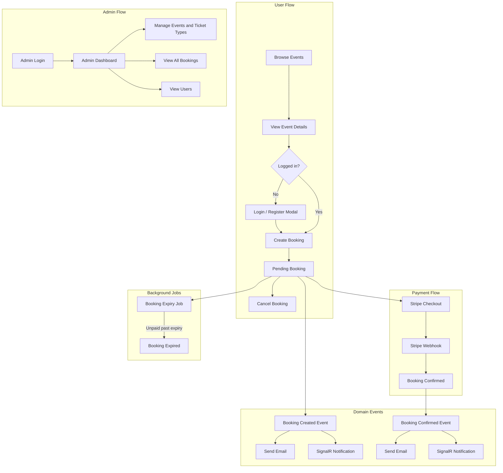

# Evently - Event Booking System

Evently is an ASP.NET Core MVC web application for browsing events, booking tickets, and managing event reservations. Users can create bookings, pay online, receive notifications, and view their booking history, while admins can manage events, users, bookings, and dashboard statistics.

## Features

### User Features

- Browse paginated available events from the home page.
- View event details and available ticket types.
- Register, log in, and log out using ASP.NET Core Identity.
- Create ticket bookings with pending reservation expiry.
- View paginated booking history and booking details.
- Cancel pending bookings.
- Pay for bookings through Stripe Checkout.
- Receive booking notifications through SignalR.
- Receive booking-related emails when email settings are configured.

### Admin Features

- Admin dashboard with event, user, booking, and revenue statistics.
- Create, edit, view, and cancel events.
- Manage event ticket types.
- View all bookings.
- View registered users.
- Role-based admin access through ASP.NET Core Identity.

## System Flow

The diagram below shows the main paths through the application: browsing and booking, Stripe payment confirmation, domain-event notifications, background expiry, and admin management.



## Technologies Used

- .NET 10
- ASP.NET Core MVC and Razor Views
- Entity Framework Core 10
- SQL Server
- ASP.NET Core Identity
- SignalR
- Stripe.net
- MailKit and MimeKit
- Bootstrap
- jQuery and jQuery Validation

## Project Structure

```text
EventBookingSystem/
  Areas/Admin/           Admin controllers and views
  Api/Controllers/       API endpoints for auth, notifications, email, and Stripe webhooks
  Controllers/           MVC controllers for public/user flows
  Data/                  EF Core DbContext, migrations, and identity seeding
  DomainEvents/          Booking email and notification event handlers
  Hubs/                  SignalR notification hub
  Models/                Domain models
  Repositories/          Repository and Unit of Work implementation
  Services/              Application services
  Views/                 Razor views
  wwwroot/               Static assets
```

## Prerequisites

- .NET 10 SDK
- SQL Server or SQL Server Express
- Stripe account for payment testing
- SMTP email account if you want email notifications

## Local Setup

From the repository root, move into the ASP.NET Core project folder:

```powershell
cd .\EventBookingSystem
```

Restore NuGet packages and local .NET tools:

```powershell
dotnet restore
dotnet tool restore
```

Configure local secrets. Replace the values with your local SQL Server, Stripe, email, and admin credentials:

```powershell
dotnet user-secrets set "ConnectionStrings:DefaultConnection" "Server=(localdb)\MSSQLLocalDB;Database=EventBookingSystem;Trusted_Connection=True;MultipleActiveResultSets=true;TrustServerCertificate=True"

dotnet user-secrets set "AdminSeed:Email" "admin@example.com"
dotnet user-secrets set "AdminSeed:Password" "AdminPassword123"

dotnet user-secrets set "Stripe:SecretKey" "sk_test_your_secret_key"
dotnet user-secrets set "Stripe:PublishableKey" "pk_test_your_publishable_key"
dotnet user-secrets set "Stripe:WebhookSecret" "whsec_your_webhook_secret"

dotnet user-secrets set "MailSettings:Email" "your-email@example.com"
dotnet user-secrets set "MailSettings:DisplayName" "Evently"
dotnet user-secrets set "MailSettings:Password" "your-email-password"
dotnet user-secrets set "MailSettings:Host" "smtp.example.com"
dotnet user-secrets set "MailSettings:Port" "587"
```

Notes:

- `ConnectionStrings:DefaultConnection` is required.
- `ApplicationSettings:BaseUrl` is used in booking emails (it's in appSettings for local dev). For production, set it to the deployed site URL.
- `AdminSeed:Email` and `AdminSeed:Password` are optional, but if one is configured, both must be configured.
- Stripe settings are required for checkout and webhook payment confirmation.
- Mail settings are required for booking email notifications.

Apply EF Core migrations:

```powershell
dotnet ef database update
```

Run the application:

```powershell
dotnet run
```

Open one of the launch URLs:

- `https://localhost:7235`
- `http://localhost:5212`

## Stripe Webhooks

For local webhook testing, install the [Stripe CLI](https://docs.stripe.com/stripe-cli/install) and forward events to the app:

```powershell
stripe listen --forward-to https://localhost:7235/api/webhook
```

Use the webhook signing secret from the Stripe CLI output as `Stripe:WebhookSecret`.

## Production Configuration

For deployment, configure these values as environment variables:

- `ConnectionStrings__DefaultConnection`
- `ApplicationSettings__BaseUrl`
- `AdminSeed__Email`
- `AdminSeed__Password`
- `Stripe__SecretKey`
- `Stripe__PublishableKey`
- `Stripe__WebhookSecret`
- `MailSettings__Email`
- `MailSettings__DisplayName`
- `MailSettings__Password`
- `MailSettings__Host`
- `MailSettings__Port`

## Admin Access

If `AdminSeed:Email` and `AdminSeed:Password` are configured before startup, the app will create or update that account as an admin user after migrations have been applied. Use those credentials to access the admin area.
