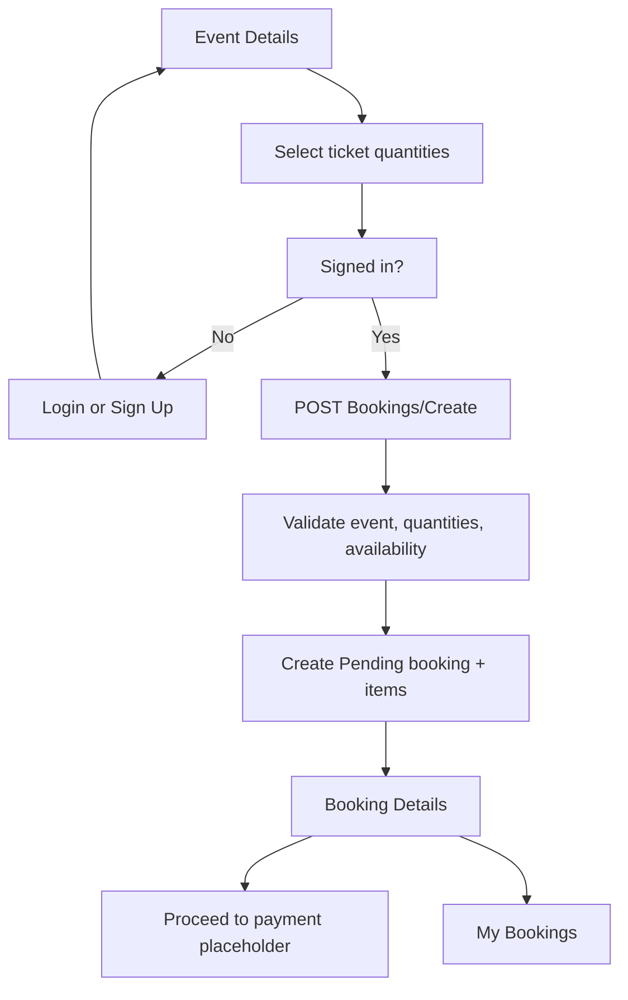

# Booking + Views Plan

## Goal

Implement the booking flow and user/admin booking views while leaving Stripe/payment integration as a placeholder for later learning work.

## Current Status

Implementation complete for booking and view scope. Payment integration remains intentionally out of scope.

Existing code already has `Booking`, `BookingItem`, `Payment`, repositories, and admin booking list foundations. Missing pieces are user booking creation, booking status/expiry, computed ticket availability, user booking pages, and auth handoff for booking.

## Completed Tasks

- [x] Explored existing event, ticket, booking, payment, auth, and Razor view structure
- [x] Decided booking should be created before payment as `Pending`
- [x] Decided one booking can include multiple ticket types and quantities
- [x] Decided post-booking destination is booking details/summary with placeholder payment button
- [x] Decided pending bookings expire through `ExpiresAt`, without background job in this phase
- [x] Decided ticket availability is computed from active bookings instead of decrementing `TicketType.Quantity`
- [x] Decided event details remain public, while booking creation requires authentication
- [x] Created feature branch `feat/booking-views`
- [x] Add `BookingStatus` enum with `Pending`, `Confirmed`, `Cancelled`, and `Expired`
- [x] Add `Status` and `ExpiresAt` to `Booking`
- [x] Add EF Core migration for new booking columns
- [x] Extend event details ticket data with ticket type ID and available quantity
- [x] Replace disabled `Buy Now` UI with multi-ticket quantity booking form
- [x] Add `BookingsController` routes for create, list, and details
- [x] Add/verify login and sign-up `returnUrl` support for booking attempts
- [x] Implement booking service logic for create/list/details, lazy expiry, and availability calculation
- [x] Add user booking view models
- [x] Add `My Bookings` page
- [x] Add `Booking Details` page with order lines, status, expiry, total, and placeholder payment action
- [x] Add `My Bookings` navigation link for signed-in users who are not admins
- [x] Show booking status and expiry in admin booking list
- [x] Build/check diagnostics and fix introduced issues
- [x] Apply the new EF migration to the development database
- [x] Manually test booking flow in browser as anonymous user and normal signed-in user

## Remaining Tasks

- [ ] Integrate Stripe/payment confirmation later

## Decisions Made

- Booking status lifecycle starts with `Pending`; later payment work can move bookings to `Confirmed` or cancellation/expiry states.
- `TicketType.Quantity` remains total capacity. Availability is calculated as total capacity minus active booking items, where active means `Confirmed` plus `Pending` bookings that have not expired.
- Pending bookings get `ExpiresAt`. No hosted background cleanup job now; booking flows will lazily expire old pending bookings.
- Event listing and event details are public.
- Booking actions require signed-in users via authorization.
- Anonymous booking attempts redirect to login/sign-up with `returnUrl`, then return to continue the booking flow.
- Use existing MVC/Razor patterns, Bootstrap styling, repository/unit-of-work style, and service layer structure.
- Payment integration remains out of scope: no Stripe checkout session, webhook, payment table update, or confirmation logic.

## Risks / Notes

- Concurrency can oversell tickets if two users book same inventory at same time. Initial implementation should validate availability immediately before saving; stronger database locking can be added later if needed.
- Existing `Payment` entity exists but should not be wired into this task except through placeholder UI text.
- Existing admin event edit rules depend on `BookingItems`; computed availability must not break ticket type edit restrictions.
- `returnUrl` handling must avoid open redirects by using local URL checks.

## Main Flow

## Next Immediate Action

Nothing
